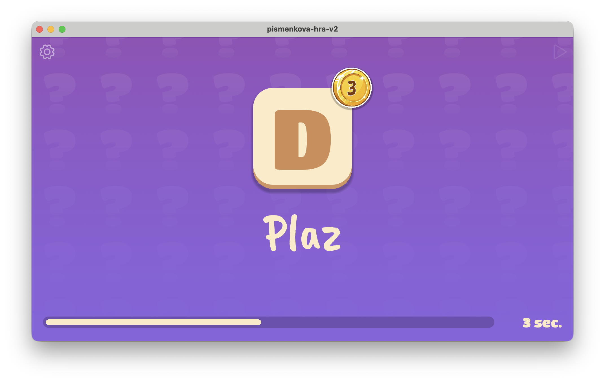

# Písmenková hra



Interaktivní aplikace pro hru v kategoriích vytvořená v Godot enginu.

## Popis

Písmenková hra je zábavná party aplikace inspirovaná klasickou hrou v kategoriích. Aplikace náhodně vylosuje písmeno a kategorii (např. "Město", "Zvíře", "Sportovec"), po kterém následuje časový limit pro vymyšlení odpovědi. Ideální pro hraní s přáteli nebo ve větší skupině.

## Hlavní funkce

- **Náhodné losování písmen a kategorií** - Aplikace postupně losuje písmeno a kategorii s vizuálními a zvukovými efekty
- **Časový limit** - Nastavitelný časovač pro každé kolo (lze vypnout)
- **Zobrazení odpovědi** - Po skončení kola lze zobrazit správnou odpověď
- **Více než 70 kategorií** - Rozmanitý výběr kategorií od geografických pojmů po popkulturní odkazy
- **Jazyková podpora** - Čeština a angličtina
- **Nastavitelné parametry** - Rychlost losování, délka kola, automatické zastavení a další

## Kategorie

Hra obsahuje širokou škálu kategorií:
- Geografie (Město, Řeka, Hora, Země)
- Lidé (Sportovec, Politik, Spisovatel, Herec)
- Příroda (Zvíře, Rostlina, Strom, Ovoce, Zelenina)
- Kultura (Film, Písnička, Kniha, TV Seriál)
- Věda (Chemický prvek, Planeta, Dinosaurus)
- a mnoho dalších...

## Ovládání

### Klávesové zkratky
- **Mezerník / Enter / Num Enter** - Start/Stop losování
- **H** - Zobrazení správné odpovědi (pouze po skončení kola)

### Tlačítka
- **Hrej/Stop** - Spuštění nebo zastavení losování
- **Nastavení** - Otevření modálního okna s nastavením aplikace

## Technické informace

### Požadavky
- Godot Engine 4.5 nebo novější
- Rozlišení: 1920x1080 (s canvas stretch módem)

### Herní mechanika

1. **Fáze losování** - Písmena a kategorie se rychle střídají s vizuálními a zvukovými efekty
2. **Zpomalení** - Po stisknutí Stop se losování postupně zpomaluje
3. **Finalizace** - Po zastavení se zobrazí vylosované písmeno a kategorie
4. **Herní kolo** - Spustí se časovač (pokud je aktivní) pro vymýšlení odpovědi
5. **Zobrazení odpovědi** - Po skončení kola lze zobrazit příkladnou správnou odpověď

### Nastavení aplikace

Aplikace podporuje vlastní nastavení:
- Rychlost losování
- Délka herního kola
- Automatické zastavení
- Zobrazení bodů
- Zvukové efekty
- Rozsah bodů

Nastavení se ukládá lokálně a přetrvává mezi spuštěními aplikace.

## Struktura projektu

```
Scripts/
├── Globals/           # Globální systémy (nastavení, zvuky, vizuální efekty)
├── game.gd           # Hlavní herní logika
├── letter.gd         # Logika losování písmen
├── subject.gd        # Logika losování kategorií
├── round.gd          # Logika časového kola
├── answer.gd         # Zobrazení správných odpovědí
└── menu.gd           # UI menu
```
